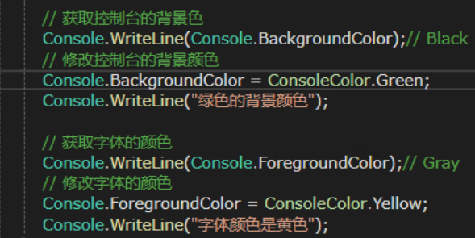
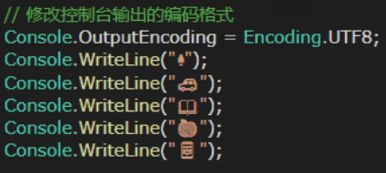
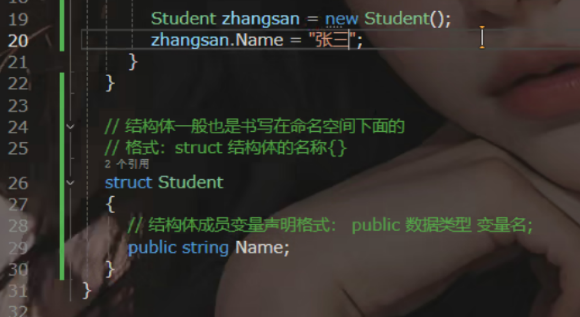
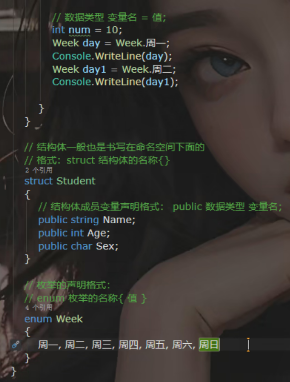
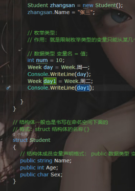

# 结构体与枚举

> [!info] 学习日期
> 07-06 结构体与枚举

---

## 结构体

结构体就像打包盒，把描述同一个对象的多个不同类型的变量组合在一起。

```c#
// 结构体声明格式：struct 结构体的名称 {}
struct Student
{
    // 成员变量声明格式：public 数据类型 变量名;
    public string Name;
    public int Age;
    public char Sex;
}
```

### 结构体的使用

```c#
// 1. 创建一个 Student 结构体实例
Student myStudent;

// 2. 依次给成员变量赋值
myStudent.Name = "张三";
myStudent.Age = 18;
myStudent.Sex = '男';

// 3. 读取使用
Console.WriteLine($"学生姓名：{myStudent.Name}，年龄：{myStudent.Age}");
```

---

## 枚举

枚举的声明格式：`enum 枚举的名称 { 值 }`

```c#
enum Week
{
    周一,
    周二,
    周三 = 9,
    周四,
    周五,
    周六,
    周日
}
```

---

## 课堂截图







> 注：以上图片来自课堂截图，与上方代码示例对应。

---

## 结构体进阶

> 来源：`D:\study\C#1\stu0728\结构体`

### 结构体实现接口

结构体可以实现接口，就像类一样：

```csharp
interface IA
{
    string Name { get; set; }
}

struct Test2 : IA
{
    public string Name { get => throw new NotImplementedException(); set => throw new NotImplementedException(); }
}
```

### 结构体构造函数规则

```csharp
struct MyStruct
{
    private int a;
    private string Name { get; set; }

    // 结构体可以定义有参构造函数
    public MyStruct(string name)
    {
        a = 0;          // 必须在构造函数中初始化所有字段
        Name = name;
    }

    public void Fn() { }
    public static void Fn(int a) { }
}
```

### 结构体 vs 类 完整对比

| 特性 | 结构体（struct） | 类（class） |
|------|-----------------|-------------|
| 数据类型 | **值类型**（stack 分配） | **引用类型**（heap 分配） |
| 继承 | ❌ 不能继承其他结构体或类 | ✅ 可以继承其他类 |
| 被继承 | ❌ 不能作为基类 | ✅ 可以作为基类 |
| 无参构造函数 | ❌ 不能定义无参构造函数 | ✅ 可以 |
| 有参构造函数 | ✅ 可以，但必须初始化**所有**字段和属性 | ✅ 可以，选择性初始化 |
| 默认构造函数 | C# 自动提供无参构造（初始化为默认值） | 编译器不提供默认构造 |
| 接口实现 | ✅ 可以实现接口 | ✅ 可以实现接口 |
| 字段初始化 | ❌ 不能直接在声明时初始化 | ✅ 可以直接初始化 |

> **选择建议**：结构体适合小型、轻量、不可变的数据结构（如 `Point`、`Complex`）。对于包含复杂逻辑、需要继承的场景，使用类。

---

## 相关笔记

- [[01-基础语法/定义变量]] — 变量定义基础
- [[01-基础语法/运算符]] — 运算符基础
- [[08-面向对象/类与对象/基础]] — 类与对象（结构体 vs 类）
- [[08-面向对象/类与对象/接口]] — 结构体实现接口
- [[01-基础语法/CSharp数据类型]] — 值类型与引用类型
