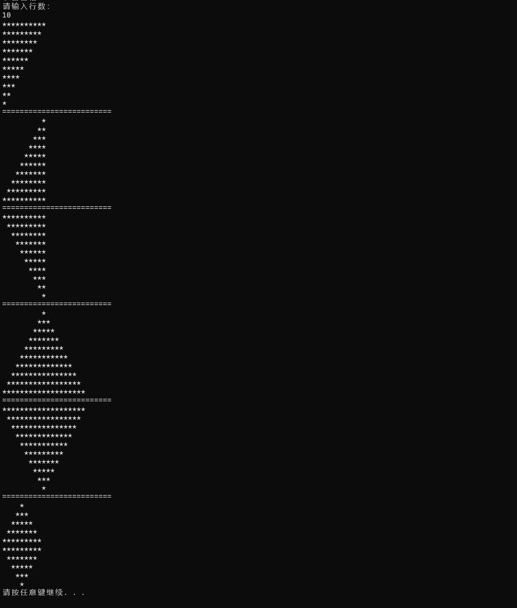

# 综合练习 50 题

> 覆盖基础语法、流程控制、循环、方法、随机数、数组的 50 道综合练习题，按知识点分阶段整理。

---

## 第一阶段：控制台输入输出与变量类型 (1-10)

**目标**：熟悉 `Console` 类，掌握基本数据类型 (`int`, `double`, `string`, `bool`, `char`) 及声明赋值规则。

1. **你好世界**

编写程序，在控制台输出一行文字："Hello, C# Student!"。

```csharp
Console.WriteLine("Hello, C# Student!");
```

1. **个人信息卡**

定义变量存储姓名（`string`）、年龄（`int`）、身高（`double`）。从控制台依次输入这些信息，最后格式化输出（例如：“我叫张三，今年 20 岁，身高 1.75 米”）。

```csharp
Console.Write("请输入姓名: ");
string name = Console.ReadLine();
Console.Write("请输入年龄: ");
int age = int.Parse(Console.ReadLine());
Console.Write("请输入身高: ");
double height = double.Parse(Console.ReadLine());

Console.WriteLine($"我叫{name}，今年{age}岁，身高{height}米");
```

1. **两数之和**

从控制台输入两个整数，计算并输出它们的和。

```csharp
Console.Write("输入第一个整数: ");
int n1 = int.Parse(Console.ReadLine());
Console.Write("输入第二个整数: ");
int n2 = int.Parse(Console.ReadLine());
Console.WriteLine($"和为: {n1 + n2}");
```

1. **温度转换**

输入摄氏度（`double`），将其转换为华氏度（公式： F=C×1.8+32）并输出结果。

```csharp
Console.Write("输入摄氏度: ");
double c = double.Parse(Console.ReadLine());
double f = c * 1.8 + 32;
Console.WriteLine($"华氏度为: {f}");
```

1. **字符测试**

输入一个字符，输出该字符对应的整数编码值（ASCII/Unicode）。

```csharp
Console.Write("输入一个字符: ");
char ch = Console.ReadKey().KeyChar; // 读取单个字符
Console.WriteLine(); // 换行
Console.WriteLine($"字符 '{ch}' 的编码值是: {(int)ch}");
```

1. **布尔判断**

输入一个整数，判断它是否大于 100。将判断结果存储在 `bool` 变量中，并输出 "True" 或 "False"。

```csharp
Console.Write("输入一个整数: ");
int num = int.Parse(Console.ReadLine());
bool isGreater = num > 100;
Console.WriteLine($"是否大于100: {isGreater}");
```

1. **变量声明与赋值实验**

- 声明一个 `int` 变量 `number`，初始化为 10，输出其值。
- 将 `number` 修改为 500，再次输出。
- 尝试将一个 `double` 类型的小数（如 3.14）直接赋值给 `int` 变量，观察编译器报错信息（理解强类型限制）。

```csharp
int number = 10;
Console.WriteLine($"初始值: {number}");

number = 500;
Console.WriteLine($"修改后: {number}");

// 下面这行会报错，演示强类型限制
// number = 3.14; 
Console.WriteLine("尝试将 double 赋给 int 会导致编译错误: Cannot implicitly convert type 'double' to 'int'.");
```

2. **字符串拼接**

输入用户的姓和名。分别使用 `+` 连接符和 `$` 插值字符串两种方式输出全名。

```csharp
Console.Write("姓: ");
string firstName = Console.ReadLine();
Console.Write("名: ");
string lastName = Console.ReadLine();

// 方式1: +
string fullName1 = firstName + lastName;
// 方式2: $
string fullName2 = $"{firstName}{lastName}";

Console.WriteLine($"连接符结果: {fullName1}");
Console.WriteLine($"插值结果: {fullName2}");
```

1. **类型转换挑战**

输入一个数字字符串（如 "123.45"），使用 `Convert.ToDouble` 或 `double.Parse` 将其转换为 `double` 类型，输出转换后的数值及其乘以 2 的结果。

```csharp
Console.Write("输入数字字符串: ");
string input = Console.ReadLine();
double val = double.Parse(input);
Console.WriteLine($"转换后: {val}, 乘以2: {val * 2}");
```

---

## 第二阶段：算术、自增自减与比较运算符 (11-20)

**目标**：熟练运用 `+, -, *, /, %`, `++, --`, `>, <, ==, !=` 等运算符。

1. **四则运算器**

输入两个数和运算符（+ - * /），输出计算结果。（注：若除数为 0，可暂时仅输出提示，暂不强制要求复杂异常处理）。

```csharp
Console.Write("输入数字1: ");
double x = double.Parse(Console.ReadLine());
Console.Write("输入数字2: ");
double y = double.Parse(Console.ReadLine());
Console.Write("输入运算符 (+ - * /): ");
string op = Console.ReadLine();

if (op == "+") Console.WriteLine(x + y);
else if (op == "-") Console.WriteLine(x - y);
else if (op == "*") Console.WriteLine(x * y);
else if (op == "/")
{
    if (y == 0) Console.WriteLine("除数不能为0");
    else Console.WriteLine(x / y);
}
```

1. **取余应用**

输入一个整数，使用 `%` 运算符判断它是奇数还是偶数并输出。

```csharp
Console.Write("输入整数: ");
int n = int.Parse(Console.ReadLine());
if (n % 2 == 0) Console.WriteLine("偶数");
else Console.WriteLine("奇数");
```

1. **自增自减差异**

定义 `int a = 5;`。分别演示 `b = a++` 和 `c = ++a` 的区别。输出最终 a, b, c 的值以验证理解。

```csharp
int a = 5;
int b = a++; // b=5, a=6
int c = ++a; // a=7, c=7
Console.WriteLine($"a={a}, b={b}, c={c}"); // 输出: a=7, b=5, c=7
```

1. **整除陷阱**

输入两个整数 `x` 和 `y`，计算 `x / y`。观察为什么 `5 / 2` 结果是 `2`。修改代码（将其中一个数转为 `double`）使其输出 `2.5`。

```csharp
int i1 = 5, i2 = 2;
Console.WriteLine($"整数除法: {i1 / i2}"); // 2

double d1 = 5, d2 = 2;
Console.WriteLine($"浮点除法: {d1 / d2}"); // 2.5
// 或者强制转换
Console.WriteLine($"强制转换: {(double)i1 / i2}");
```

1. **比较大小**

输入三个整数，仅通过比较运算符（`>` `<`）找出最大值并输出。

```csharp
Console.Write("数1: "); int v1 = int.Parse(Console.ReadLine());
Console.Write("数2: "); int v2 = int.Parse(Console.ReadLine());
Console.Write("数3: "); int v3 = int.Parse(Console.ReadLine());

int max = v1;
if (v2 > max) max = v2;
if (v3 > max) max = v3;
Console.WriteLine($"最大值: {max}");
```

1. **区间判断**

输入一个分数（0-100），使用比较运算符判断是否在及格范围（60-100）内，输出 "Pass" 或 "Fail"。

```csharp
Console.Write("输入分数: ");
double score = double.Parse(Console.ReadLine());
bool isPass = score >= 60 && score <= 100;
Console.WriteLine(isPass ? "Pass" : "Fail");
```

1. **相等性测试**

输入两个浮点数，判断它们是否完全相等。思考并简单记录：为什么在某些情况下 `0.1 + 0.2 == 0.3` 可能返回 false？ 百度一下 也可以问一下你的豆包 这是计算机底层问题 是关于二进制的转换

```csharp
double a = 0.1 + 0.2;
double b = 0.3;
Console.WriteLine($"直接比较 (==): {a == b}"); // False
Console.WriteLine($"原因: 二进制精度丢失，0.1+0.2 实际约为 0.30000000000000004");
```

1. **时间转换**

输入总分钟数（`int`），计算并输出对应的小时数和剩余分钟数（使用 `/` 和 `%`）。

```csharp
Console.Write("输入总分钟: ");
int totalMin = int.Parse(Console.ReadLine());
int hours = totalMin / 60;
int mins = totalMin % 60;
Console.WriteLine($"{hours}小时 {mins}分钟");
```

1. **三位数反转**

输入一个三位整数（如 123），通过算术运算（不使用字符串反转）将其反转输出（321）。

```csharp
Console.Write("输入三位数: ");
int num = int.Parse(Console.ReadLine());
int hundreds = num / 100;
int tens = (num / 10) % 10;
int ones = num % 10;
int reversed = ones * 100 + tens * 10 + hundreds;
Console.WriteLine($"反转后: {reversed}");
```

1. **复合赋值**

定义变量 `int x = 10;`。依次执行 `x += 5`, `x *= 2`, `x %= 7`。输出每一步操作后 `x` 的结果。

```csharp
int x = 10;
x += 5;  // 15
Console.WriteLine(x);
x *= 2;  // 30
Console.WriteLine(x);
x %= 7;  // 30 % 7 = 2
Console.WriteLine(x);
```

---

## 第三阶段：逻辑运算符与三目运算符 (21-30)

**目标**：掌握 `&&`, `||`, `!` 以及 `条件 ? 真 : 假` 结构。

1. **闰年判断（逻辑版）**

输入年份，使用逻辑运算符判断是否为闰年：(能被 4 整除 且 不能被 100 整除) 或 (能被 400 整除)。

```csharp
Console.Write("输入年份: ");
int year = int.Parse(Console.ReadLine());
bool isLeap = (year % 4 == 0 && year % 100 != 0) || (year % 400 == 0);
Console.WriteLine(isLeap ? "闰年" : "平年");
```

1. **登录验证**

预设用户名 "admin" 和密码 "123456"。输入用户提供的账号密码，只有两者**都**正确才输出 "登录成功"，否则输出 "失败"。

```csharp
string user = "admin";
string pass = "123456";
Console.Write("用户名: ");
string inUser = Console.ReadLine();
Console.Write("密码: ");
string inPass = Console.ReadLine();

if (inUser == user && inPass == pass)
    Console.WriteLine("登录成功");
else
    Console.WriteLine("失败");
```

1. **短路逻辑测试**

编写代码演示 `&&` 的短路特性。例如：`if (false && (某个会报错的操作))`，确保后面的操作不会执行。

```csharp
// 如果第一个条件为 false，第二个条件不会执行，避免报错
if (false && (1 / 0 == 1)) 
{
    Console.WriteLine("不会执行");
}
Console.WriteLine("短路测试通过，程序未崩溃");
```

1. **三目运算基础**

输入一个整数，使用三目运算符判断正负，输出 "Positive" 或 "Non-positive"。

```csharp
Console.Write("输入整数: ");
int n = int.Parse(Console.ReadLine());
string result = n > 0 ? "Positive" : "Non-positive";
Console.WriteLine(result);
```

1. **最大值简化**

输入两个数，使用三目运算符找出最大值并输出。

```csharp
Console.Write("数1: "); int a = int.Parse(Console.ReadLine());
Console.Write("数2: "); int b = int.Parse(Console.ReadLine());
int max = (a > b) ? a : b;
Console.WriteLine(max);
```

1. **等级简化**

输入分数，若 >=60 输出 "Pass"，否则 "Fail"（必须使用三目运算符）。

```csharp
Console.Write("分数: ");
double s = double.Parse(Console.ReadLine());
Console.WriteLine(s >= 60 ? "Pass" : "Fail");
```

1. **复杂逻辑**

输入三个布尔值代表三个开关状态。如果**至少有两个**开关为真，输出 "System Active"，否则 "System Offline"。

```csharp
Console.Write("开关1 (true/false): "); bool s1 = bool.Parse(Console.ReadLine());
Console.Write("开关2 (true/false): "); bool s2 = bool.Parse(Console.ReadLine());
Console.Write("开关3 (true/false): "); bool s3 = bool.Parse(Console.ReadLine());

// 逻辑：(1且2) 或 (1且3) 或 (2且3)
bool active = (s1 && s2) || (s1 && s3) || (s2 && s3);
Console.WriteLine(active ? "System Active" : "System Offline");
```

1. **空值模拟**

输入一个字符串。如果长度为 0，使用三目运算符输出 "Empty"，否则输出 "Has Content"。

```csharp
Console.Write("输入字符串: ");
string str = Console.ReadLine();
Console.WriteLine(str.Length == 0 ? "Empty" : "Has Content");
```

1. **嵌套三目**

输入分数，使用**嵌套**三目运算符输出等级：>=90 为 "A", >=60 为 "B", <60 为 "C"。

```csharp
Console.Write("分数: ");
double sc = double.Parse(Console.ReadLine());
string grade = sc >= 90 ? "A" : (sc >= 60 ? "B" : "C");
Console.WriteLine(grade);
```

1. **逻辑非应用**

输入一个布尔值（true/false），输出它的相反值，并用文字描述（如输入 true，输出 "Result: False"）。

```csharp
Console.Write("输入 true 或 false: ");
bool val = bool.Parse(Console.ReadLine());
bool opposite = !val;
Console.WriteLine($"Result: {opposite}");
```

---

## 第四阶段：流程控制 if-else 与 switch-case (31-45)

**目标**：灵活运用分支结构解决复杂逻辑问题。

1. **成绩等级（if-else）**

输入分数，输出等级：90-100(A), 80-89(B), 70-79(C), 60-69(D), <60(E)。

```csharp
Console.Write("分数: ");
double s = double.Parse(Console.ReadLine());
if (s >= 90) Console.WriteLine("A");
else if (s >= 80) Console.WriteLine("B");
else if (s >= 70) Console.WriteLine("C");
else if (s >= 60) Console.WriteLine("D");
else Console.WriteLine("E");
```

1. **简单计算器（switch）**

输入两个数和运算符 (+, -, *, /)，使用 `switch` 语句执行计算并输出结果。

```csharp
// 假设已输入 n1, n2, op (参考第11题输入部分)
// ... 输入代码省略 ...
double n1 = 10, n2 = 2; string op = "+"; // 示例数据

switch (op)
{
    case "+": Console.WriteLine(n1 + n2); break;
    case "-": Console.WriteLine(n1 - n2); break;
    case "*": Console.WriteLine(n1 * n2); break;
    case "/": 
        if(n2!=0) Console.WriteLine(n1 / n2); 
        else Console.WriteLine("Error"); 
        break;
    default: Console.WriteLine("无效运算符"); break;
}
```

1. **季节判断**

输入月份（1-12），使用 `switch` 输出对应的季节（春：3-5, 夏：6-8, 秋：9-11, 冬：12,1,2）。

```csharp
Console.Write("月份: ");
int m = int.Parse(Console.ReadLine());
string season;
switch (m)
{
    case 3: case 4: case 5: season = "春"; break;
    case 6: case 7: case 8: season = "夏"; break;
    case 9: case 10: case 11: season = "秋"; break;
    case 12: case 1: case 2: season = "冬"; break;
    default: season = "无效月份"; break;
}
Console.WriteLine(season);
```

1. **三角形判断**

输入三角形的三条边。先判断能否构成三角形，若能，进一步判断是等边、等腰还是普通三角形。

```csharp
Console.Write("边1: "); double a = double.Parse(Console.ReadLine());
Console.Write("边2: "); double b = double.Parse(Console.ReadLine());
Console.Write("边3: "); double c = double.Parse(Console.ReadLine());

if (a + b > c && a + c > b && b + c > a)
{
    if (a == b && b == c) Console.WriteLine("等边三角形");
    else if (a == b || a == c || b == c) Console.WriteLine("等腰三角形");
    else Console.WriteLine("普通三角形");
}
else
{
    Console.WriteLine("不能构成三角形");
}
```

1. **Switch 穿透案例**

输入月份，输出该月的天数（不考虑闰年，2 月固定 28 天）。利用 `case` 穿透特性（不加 break）合并相同天数的月份。

```csharp
Console.Write("月份: ");
int month = int.Parse(Console.ReadLine());
int days;
switch (month)
{
    case 1: case 3: case 5: case 7: case 8: case 10: case 12:
        days = 31; break;
    case 4: case 6: case 9: case 11:
        days = 30; break;
    case 2:
        days = 28; break; // 简化版，不考虑闰年
    default:
        days = -1; break;
}
Console.WriteLine(days == -1 ? "无效月份" : $"{days}天");
```

1. **折扣系统**

输入购物金额。>1000 打 8 折，>500 打 9 折，其余原价。使用 `if-else` 实现并输出最终价格。

```csharp
Console.Write("金额: ");
double amount = double.Parse(Console.ReadLine());
double finalPrice;
if (amount > 1000) finalPrice = amount * 0.8;
else if (amount > 500) finalPrice = amount * 0.9;
else finalPrice = amount;
Console.WriteLine($"最终价格: {finalPrice}");
```

1. **菜单选择**

显示菜单（1.查询 2.存款 3.取款 4.退出）。输入选项，使用 `switch` 执行对应提示，输入其他数字提示错误。

```csharp
Console.WriteLine("1.查询 2.存款 3.取款 4.退出");
Console.Write("选择: ");
int choice = int.Parse(Console.ReadLine());
switch (choice)
{
    case 1: Console.WriteLine("执行查询..."); break;
    case 2: Console.WriteLine("执行存款..."); break;
    case 3: Console.WriteLine("执行取款..."); break;
    case 4: Console.WriteLine("退出"); break;
    default: Console.WriteLine("错误选项"); break;
}
```

1. **字符分类**

输入一个字符，判断它是大写字母、小写字母、数字还是其他符号。

```csharp
Console.Write("输入字符: ");
char ch = Console.ReadKey().KeyChar;
Console.WriteLine();
if (ch >= 'A' && ch <= 'Z') Console.WriteLine("大写字母");
else if (ch >= 'a' && ch <= 'z') Console.WriteLine("小写字母");
else if (ch >= '0' && ch <= '9') Console.WriteLine("数字");
else Console.WriteLine("其他符号");
```

1. **双人对战（石头剪刀布）**

- 提示“玩家 1 请输入（0:石, 1:剪, 2:布）”，读取输入。
- 使用 `Console.Clear()` 清屏。
- 提示“玩家 2 请输入（0:石, 1:剪, 2:布）”，读取输入。
- 比较两者输入，输出谁赢了或平局。

```csharp
Console.Write("玩家1 (0:石, 1:剪, 2:布): ");
int p1 = int.Parse(Console.ReadLine());

Console.Clear(); // 清屏隐藏

Console.Write("玩家2 (0:石, 1:剪, 2:布): ");
int p2 = int.Parse(Console.ReadLine());

if (p1 == p2) Console.WriteLine("平局");
else if ((p1 == 0 && p2 == 1) || (p1 == 1 && p2 == 2) || (p1 == 2 && p2 == 0))
    Console.WriteLine("玩家1赢");
else
    Console.WriteLine("玩家2赢");
```

1. **税率计算**

输入月收入。<=5000 免税，5000-8000 部分 10%，>8000 部分 20%。计算并输出应纳税额（简化版阶梯税）。

```csharp
Console.Write("月收入: ");
double income = double.Parse(Console.ReadLine());
double tax = 0;
if (income > 8000)
{
    tax += (income - 8000) * 0.2;
    income = 8000;
}
if (income > 5000)
{
    tax += (income - 5000) * 0.1;
}
Console.WriteLine($"应纳税: {tax}");
```

1. **Switch 默认值**

输入星期几的数字（1-7），输出中文名称。如果输入不在范围内，利用 `default` 输出 "无效输入"。

```csharp
Console.Write("星期几 (1-7): ");
int day = int.Parse(Console.ReadLine());
string name;
switch (day)
{
    case 1: name = "周一"; break;
    case 2: name = "周二"; break;
    // ... 省略中间 ...
    case 7: name = "周日"; break;
    default: name = "无效输入"; break;
}
Console.WriteLine(name);
```

1. **嵌套 if 逻辑（ATM 模拟）**

模拟取款：先判断余额是否充足，再判断取款金额是否是 100 的倍数，再判断是否超过每日限额。每一步都用 `if` 嵌套。

```csharp
double balance = 1000;
double dailyLimit = 500;
Console.Write("取款金额: ");
double amount = double.Parse(Console.ReadLine());

if (amount <= balance)
{
    if (amount % 100 == 0)
    {
        if (amount <= dailyLimit)
            Console.WriteLine("取款成功");
        else
            Console.WriteLine("超过每日限额");
    }
    else
        Console.WriteLine("必须是100的倍数");
}
else
    Console.WriteLine("余额不足");
```

1. **元音检测**

输入一个字母，使用 `switch` 判断是否为元音字母 (a, e, i, o, u)，忽略大小写（可利用 case 合并）。

```csharp
Console.Write("输入字母: ");
char c = char.ToLower(Console.ReadKey().KeyChar);
Console.WriteLine();
switch (c)
{
    case 'a': case 'e': case 'i': case 'o': case 'u':
        Console.WriteLine("元音"); break;
    default:
        Console.WriteLine("辅音或其他"); break;
}
```

1. **三个数排序**

输入三个整数，使用 `if-else` 交换逻辑，将它们从小到大排序输出。

```csharp
Console.Write("数1: "); int x = int.Parse(Console.ReadLine());
Console.Write("数2: "); int y = int.Parse(Console.ReadLine());
Console.Write("数3: "); int z = int.Parse(Console.ReadLine());

// 冒泡思想交换
if (x > y) { int t = x; x = y; y = t; }
if (y > z) { int t = y; y = z; z = t; }
if (x > y) { int t = x; x = y; y = t; }

Console.WriteLine($"{x}, {y}, {z}");
```

1. **除法保护**

在使用 `switch` 做除法时，如果用户选择 '/' 且第二个数为 0，在 `case` 内部输出错误信息“除数不能为零”，而不是执行除法。

```csharp
// 假设在 switch 的 case '/': 分支中
double num2 = 0;
if (num2 == 0)
{
    Console.WriteLine("除数不能为零");
    // 不执行除法
}
else
{
    // 执行除法
}
```

---

## 第五阶段：Goto 语句与综合挑战 (46-50)

**目标**：理解 `goto` 的用法（用于跳出深层逻辑或实现简单循环），综合运用所有知识。

1. **Goto 基础输入验证**

编写代码，使用 `goto` 标签实现一个简单的输入循环：提示输入一个正整数，如果用户输入负数或 0，则 `goto` 到输入提示处重新输入，直到输入合法为止。

```csharp
InputStart:
Console.Write("请输入一个正整数: ");
int val = int.Parse(Console.ReadLine());
if (val <= 0)
{
    Console.WriteLine("错误！必须大于0。");
    goto InputStart;
}
Console.WriteLine($"输入有效: {val}");
```

1. **跳出嵌套逻辑**

模拟一个深层嵌套的 `if` 结构（例如 3 层）。当在最内层发现特定错误条件时，使用 `goto` 直接跳转到程序末尾的输出环节，跳过中间所有逻辑。

```csharp
Console.Write("输入层级1: "); int l1 = int.Parse(Console.ReadLine());
if (l1 == 1)
{
    Console.Write("输入层级2: "); int l2 = int.Parse(Console.ReadLine());
    if (l2 == 2)
    {
        Console.Write("输入层级3: "); int l3 = int.Parse(Console.ReadLine());
        if (l3 == -1)
        {
            Console.WriteLine("发现错误，直接跳出！");
            goto EndProgram;
        }
        Console.WriteLine("层级3正常");
    }
    Console.WriteLine("层级2正常");
}
Console.WriteLine("层级1正常");

EndProgram:
Console.WriteLine("程序结束部分。");
```

1. **简易状态机**

使用 `goto` 和 `switch` 模拟状态跳转：

- 状态 A：等待开始（输入 1 跳转到 B）。
- 状态 B：处理中（输入 2 跳转到 C，输入 0 跳转回 A）。
- 状态 C：结束（输出 "Finished" 并终止）。

```csharp
StateA:
Console.WriteLine("[状态A] 等待开始 (输入1继续): ");
if (Console.ReadLine() == "1") goto StateB;
else goto StateA;

StateB:
Console.WriteLine("[状态B] 处理中 (输入2去C, 0回A): ");
string inputB = Console.ReadLine();
if (inputB == "2") goto StateC;
else if (inputB == "0") goto StateA;
else goto StateB;

StateC:
Console.WriteLine("[状态C] Finished!");
```

1. **设定目标猜谜（管理员模式）**

- 步骤 1：提示“管理员请输入秘密数字（1-100）”，读取并存储。
- 步骤 2：`Console.Clear()` 清屏。
- 步骤 3：使用 `goto` 构建猜测循环。提示“挑战者请猜”，输入后判断大了/小了。
- 步骤 4：猜对后，输出恭喜信息，并 `goto` 跳出猜测循环。

```csharp
AdminStep:
Console.Write("管理员设定秘密数字 (1-100): ");
int secret = int.Parse(Console.ReadLine());
Console.Clear();

GuessLoop:
Console.Write("挑战者猜数字: ");
int guess = int.Parse(Console.ReadLine());
if (guess > secret)
{
    Console.WriteLine("太大了");
    goto GuessLoop;
}
else if (guess < secret)
{
    Console.WriteLine("太小了");
    goto GuessLoop;
}
else
{
    Console.WriteLine("恭喜猜对！");
    goto GameOver;
}

GameOver:
Console.WriteLine("游戏结束。");
```

1. **终极综合：简易学生录入系统**

- 主菜单使用 `switch` (1.录入 2.查看 3.退出)。
- **录入功能**：输入姓名和分数。使用 `if` 验证分数是否在 0-100 之间。若非法，使用 `goto` 要求重新输入分数。
- **查看功能**：使用三目运算符根据分数快速判断并输出“及格/不及格”。
- **退出功能**：结束程序。

```csharp
MainMenu:
Console.WriteLine("\n=== 学生系统 ===");
Console.WriteLine("1.录入 2.查看 3.退出");
Console.Write("选择: ");
string cmd = Console.ReadLine();

switch (cmd)
{
    case "1":
        Console.Write("姓名: ");
        string name = Console.ReadLine();
        
    ScoreInput:
        Console.Write("分数 (0-100): ");
        double score = double.Parse(Console.ReadLine());
        if (score < 0 || score > 100)
        {
            Console.WriteLine("分数无效，请重试！");
            goto ScoreInput;
        }
        Console.WriteLine($"录入成功: {name}, {score}");
        goto MainMenu;

    case "2":
        Console.Write("输入分数查看状态: ");
        double s = double.Parse(Console.ReadLine());
        string status = s >= 60 ? "及格" : "不及格";
        Console.WriteLine($"状态: {status}");
        goto MainMenu;

    case "3":
        Console.WriteLine("退出系统");
        break;

    default:
        Console.WriteLine("无效选项");
        goto MainMenu;
}
```

## 第六阶段：循环

1. **控制台接收行数 ,打印以下图形.如图:**

2. 统计 1 到 10000 中，回文数的个数。回文数字就是正着读和倒着读都一样 比如：11、22、33、44、55、66、77、88、99、121、 12321等等
3. 判断一个数是否是质数
4. 打印 1 到 100 的所有质数。
5. 判断一个数是否是完美数（因子之和等于自身）。
6. 打印 1 到 1000 的所有完美数。
7. 判断一个数是否是阿姆斯特朗数（水仙花数）。
8. 打印 1 到 1000 的所有水仙花数。
9. 输入一个整数 n，计算 1 到 n 中所有质数的和。
10. 输入一个整数 n，计算 1 到 n 中所有完美数的和。
11. **终极挑战**：打印 1 到 100，如果是 3 的倍数打印 "Fizz"，5 的倍数打印 "Buzz"，既是 3 又是 5 打印 "FizzBuzz"，否则打印数字。
12. 九九乘法表 3种循环写法

---

## 相关笔记

- [[01-基础语法/CSharp基础]] — 基础语法
- [[02-流程控制/循环结构]] — 循环结构
- [[02-流程控制/流程控制]] — 流程控制
- [[09-练习与项目/自学练习总结]] — 0718 自学练习
